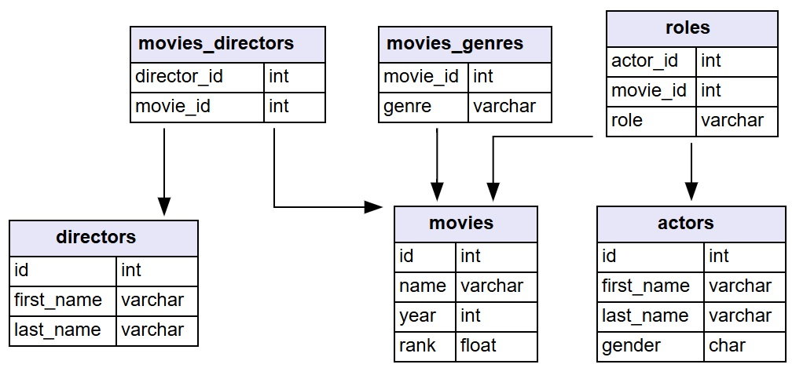

# Week 10: IMDB Database
 
## Assignment Details
### Management Problem

A lover and collector of movies has decided to learn more about Go by working on a database-backed application that draws on an open-source archive of movie data files.

**Northwestern University IMDb Data Files**

The Internet Movie Database (IMDb, imdb.com) is a well-known source of information about movies. Northwestern University maintains an archive of comma-delimited text files from this database, originally collected from https://relational.fit.cvut.cz/dataset/IMDb.

Last modified on August 20, 2022, the Northwestern archive is available at https://arch.library.northwestern.edu/concern/datasets/3484zh40n?locale=en

**SQLite for Go**

General information about SQLite is provided in the technical addendum page SQLite.

Most examples of SQLite with Go call on the driver from (https://github.com/mattn/go-sqlite3), which requires C integration with Go using cgo. As Bodner (2024, pages 433-438) points out, however, cgo imposes a performance penalty and can be difficult to use.  

Fortunately, there is a pure Go (that is, cgo-free) port of SQLite available from https://gitlab.com/cznic/sqliteLinks to an external site.

**Assignment Requirements**

Evaluate the possibilities of using Go for a personal movie database and application: 

* Download the zip/gz archive files from the Northwestern site. Extract the comma-delimited text files from the archive. There should be six files, and each file corresponds to a possible relational database table.
* Define an SQLite relational database schema to accommodate the data you have downloaded.
* Write a Go program to serve as a local database server for the cgo-free port of SQLite. 
* Implement the relational database schema in SQLite.
* Populate the SQLite database with data you have downloaded. It is sufficient to define a database with two tables, such as the movies and genres tables populated with data from the comma-delimited filed IMDB-movies.csv and IMDB-movies_genres.csv.
Show that you can perform SQL queries on the SQLite database you have created. For example, execute a JOIN query between two tables to answer a question such as "What types of movies (by genre) receive the highest ratings/ranks?" 
* In the **README.md** file of the repository, describe your efforts in setting up the SQLite relational database. Describe how you might add to this database by including a table showing the movies that you have in your personal collection, where those movies are located, and perhaps your personal ratings of the movies. Describe plans for drawing on the personal movie database. What purpose would it serve? Describe possible user interactions with the database (beyond what can be obtained from SQL queries alone).  In other words, what would a useful Go movie application look like? What would be the advantages of this application over IMDb alone?
Finally, in thse **README.md** file, describe possible database enhancements and further application development. 
(Optional) Add additional comments to the **README.md** file, considering possibilities for adding movie review information to the database. What might be the possibilities for building a personal movie recommendation system based on your personal movie reviews?

## Program description
The following main.go file contains the setup needed to create and populate a local SQLite movies database. Movie data was provided via [Northwestern ARCH](https://arch.library.northwestern.edu/concern/datasets/3484zh40n?locale=en). Running the program will create a *movies.db* file at the given file location which contains 6 tables, *actors*, *roles*, *movies*, *movie_genres*, *movie_directors*, and *directors*. A visual descripiton of the data and schema can be seen below.
### Database Schema
The following schema was used for database design


Once the database has been generated, there is a function called *queryTest()* that queries the generated database with the following code:

```SQL
WITH RankedMovies AS (
        SELECT
            m.name,
            m.rank,
            mg.genre,
            m.year,
            ROW_NUMBER() OVER (
                PARTITION BY mg.genre 
                ORDER BY m.rank DESC
            ) as rank_position
        FROM movies m
        INNER JOIN movies_genres mg ON m.id = mg.movie_id
        WHERE m.rank IS NOT NULL
    )
    SELECT
        genre,
        name,
        year,
        rank
    FROM RankedMovies
    WHERE rank_position <= 3
    ORDER BY genre, rank DESC;
```

Results of the query are writen/ exported to a file named [query_results.csv](query_results.csv) and is intened to help answer the question "What types of movies (by genre) receive the highest ratings/ranks?"

### Personalization of the database

In future iterations of this program/database, individual user interaction could be implemented which would allow for people to create collections and lists of movies that they like/ want to watch. This could be achieved by implementing 3 tables, *users*, *user_lists*, *lists*.
The *users* table would contain information regarding users, *user_lists* would contain the id's of all lists created by users, and *lists* would contain the contents of each user movie playlist including personalized comment such as personal movie rating and comments.

Taking the idea of interaction a step further, there could be the implementation of social interaction so that users could interact with each other such as liking others' ratings, planning movie events, join challenges, discussing on forums. While IMDb has a large focus of movie informaiton and critique reviews, there is a far lesser emphasis on the social connection of watching movies; which is what would distinguish this application from others. The focus on creating a forum for users to disucss their thoughts/opinions on new releases or their favorite cult-classics would be the main objective and provide an environment where users with all types of movie tastes could find like-minded individuals.

Implementation with a user's watch history (via Netflix, hulu, Max, etc.) could help generate movie reccomendations of similar watchers.